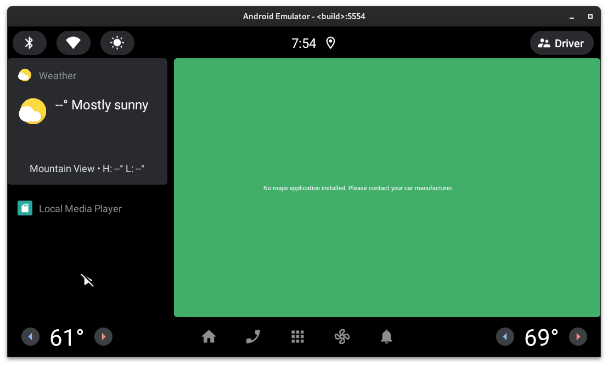
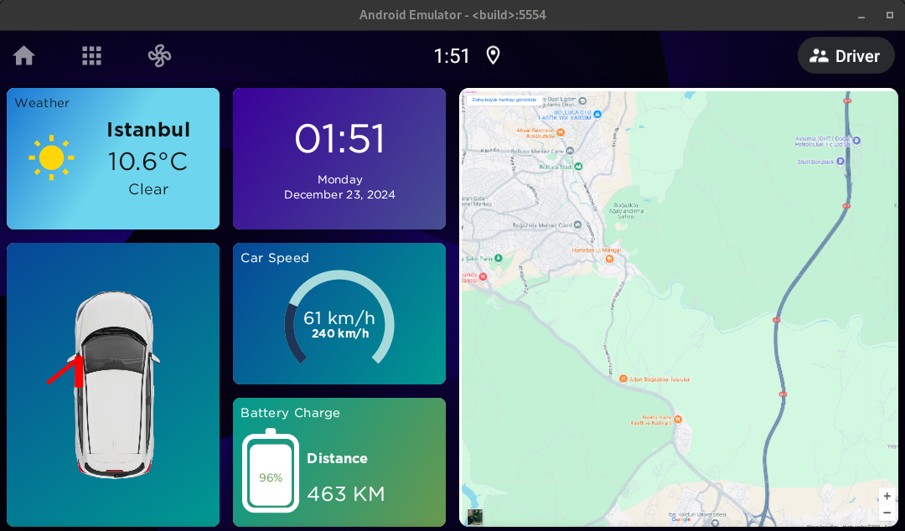
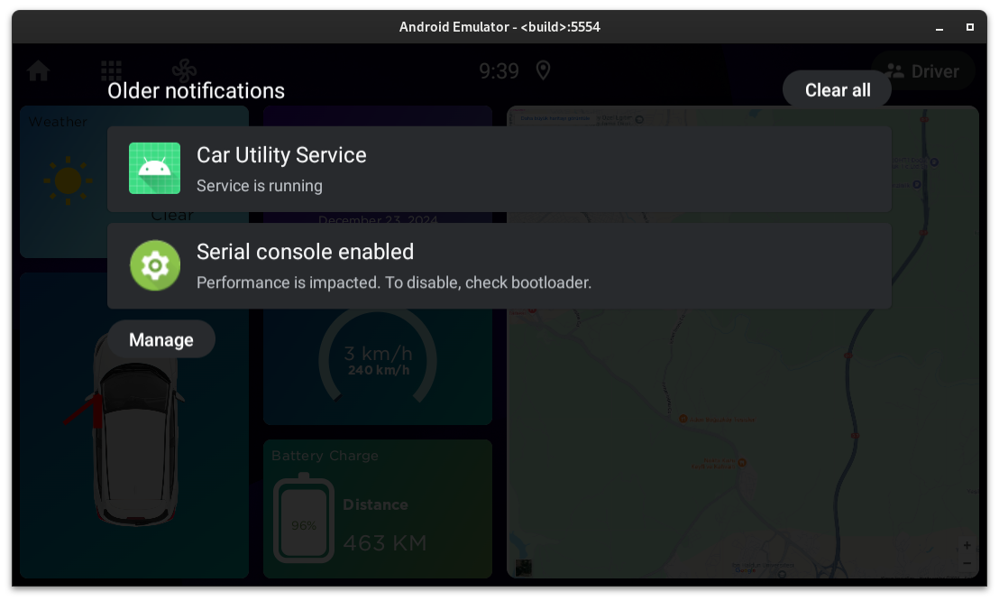

# TOGG Case Study

## 1) Launcher and SystemUI customizations

### 1-a) EmrLauncher

EmrLauncher has been created to make a car infotainment system demo.

**Default Android Automotive OS Launcher (CarLauncher package):**



**EmrLauncher:**



#### Source Code Structure & Soong Package Of EmrLauncher

Third-party libraries like Retrofit and Hilt were used to make codebase more readable and maintainable with clean architecture. But unfortunately this situation caused a problem. Those libraries are not available in AOSP codebase. So Soong build system can't detect them while building. Then the prebuilt launcher APK has been added as a prebuilt app package and overrided the default AAOS launcher.

**NOTE:** This problem was realized later and since there was no time to add third-party libraries to the AOSP or rewriting launcher app codebase, so it was decided to add a prebuilt apk of the launcher.

**Android.bp of EmrLauncher**

```bash
android_app_import {
    name: "EmrLauncher",
    apk: "EmrLauncher.apk",
    certificate: "platform",
    privileged: true,
    dex_preopt: {
        enabled: false,
    },
    overrides: [
        "Launcher2",
        "Launcher3",
        "Launcher3QuickStep",
        "CarLauncher",
    ],
}
```

As can be seen, it has been developed with an effort to adhere to a clean architecture as much as possible using view models and file hierarchy. Used Kotlin and Compose libraries to build UI.

Codebase:
```bash
src/main/java/com/emre/launcher/
├── AppDrawerActivity.kt
├── data
│   ├── api
│   │   └── WeatherAPI.kt
│   ├── models
│   │   ├── AppInfo.kt
│   │   ├── Car.kt
│   │   ├── Weather.kt
│   │   └── WeatherResponse.kt
│   └── repository
│       ├── AppRepositoryImpl.kt
│       ├── AppRepository.kt
│       ├── WeatherRepositoryImpl.kt
│       └── WeatherRepository.kt
├── di
│   ├── CarModule.kt
│   └── WeatherModule.kt
├── domain
│   └── usecases
│       ├── GetLaunchableAppsUseCase.kt
│       ├── GetWeatherUseCase.kt
│       └── ToggleDoorUseCase.kt
├── EmrLauncherApplication.kt
├── MainActivity.kt
└── ui
    ├── cards
    │   ├── CarCard.kt
    │   ├── EnergyCard.kt
    │   ├── GradientCard.kt
    │   ├── MapsCard.kt
    │   ├── SpeedCard.kt
    │   ├── TimeCard.kt
    │   └── WeatherCard.kt
    ├── theme
    │   ├── Color.kt
    │   ├── Theme.kt
    │   └── Type.kt
    ├── viewmodels
    │   ├── AppDrawerViewModel.kt
    │   ├── CarViewModel.kt
    │   └── WeatherViewModel.kt
    └── views
        ├── BatteryChargeView.kt
        ├── CarView.kt
        ├── GothamText.kt
        └── Speedometer.kt
```

#### Fetching Vehicle Data From System

Normally there is no internal Android car library (`android.car`) in Android app projects. Car library can be added by Soong with:
```bash
static_libs: [
    "androidx.appcompat_appcompat",
    "android.car",
],   
```

Or it can be added by copying `android.car.jar` from AOSP build outputs.
Path:
```bash
out/target/product/emulator_car_x86_64/system/framework
```

Also these permissions must be added in AndroidManifest.xml to get vehicle data:
```xml
<uses-permission android:name="android.car.permission.CAR_INFO" />
<uses-permission android:name="android.car.permission.CAR_POWERTRAIN" />
<uses-permission android:name="android.car.permission.CAR_ENERGY_PORTS" />
<uses-permission android:name="android.car.permission.CAR_SPEED" />
<uses-permission android:name="android.car.permission.CAR_ENERGY" />
<uses-permission android:name="android.car.permission.CONTROL_CAR_ENERGY_PORTS" />
<uses-permission android:name="android.car.permission.CAR_VENDOR_EXTENSION" />
```

Normally app must request these permissions at runtime to get vehicle information but our launcher app is a priviliged system app.

`Android.bp` file line 7:
```bash
privileged: true
```

So not necessary to request runtime permission but the app permission priviliges should be declared in `frameworks/base/data/etc/privapp-permissions-platform.xml` like this:

```xml
<privapp-permissions package="com.emre.launcher">
    <permission name="android.permission.BIND_NOTIFICATION_LISTENER_SERVICE" />
    <permission name="android.permission.ACCESS_NOTIFICATION_POLICY" />
    <permission name="android.permission.RECEIVE_BOOT_COMPLETED" />
    <permission name="android.permission.MEDIA_CONTENT_CONTROL" />
    <permission name="android.permission.QUERY_ALL_PACKAGES" />
    <permission name="android.permission.INTERNET" />
    <permission name="android.permission.BIND_VEHICLE_SERVICE" />
    <permission name="android.car.permission.CAR_INFO" />
    <permission name="android.car.permission.CAR_POWERTRAIN" />
    <permission name="android.car.permission.CAR_ENERGY_PORTS" />
    <permission name="android.car.permission.CAR_SPEED" />
    <permission name="android.car.permission.CAR_ENERGY" />
    <permission name="android.car.permission.CONTROL_CAR_ENERGY_PORTS" />
    <permission name="android.car.permission.CAR_VENDOR_EXTENSION" />
</privapp-permissions>
```

Otherwise the Android OS will get into bootloop if you don't. (Happened before)

**Optional part:**
The VHAL that written in this case study, has generated a java library to get `VehicleProperties`. This class has vehicle property enums to get data from system. Actually it is not necessary but if you added a custom vendor property, it should be added.
You can also get custom property value without this using property integer value.

**Fetching Live Car Property Data**

The VHAL written in this case study, changes `PERF_VEHICLE_SPEED` value based on char device output. It is like reading a value from a driver. It will be explained later in this document.

Since we have `android.car` library in our project, we can register a callback to get car data:

```kotlin
mCarPropertyManager = Car.createCar(this).getCarManager(Car.PROPERTY_SERVICE) as CarPropertyManager
mCarPropertyManager.registerCallback(object : CarPropertyEventCallback {
    override fun onChangeEvent(carPropertyValue: CarPropertyValue<*>) {
        Log.d("vspeed","onChangeEvent(" + carPropertyValue.value + ")")
        speed.floatValue = carPropertyValue.value as Float
    }
    override fun onErrorEvent(propId: Int, zone: Int) {
        Log.d("vspeed", "error")
    }
}, VehiclePropertyIds.PERF_VEHICLE_SPEED, CarPropertyManager.SENSOR_RATE_NORMAL)
```
Then we can update our UI with it. This example was to get vehicle speed. Other properties can be fetched from system by this way.

### 1-b) SystemUI Modifications

**Default Android Automotive OS SystemUI interface:**


**EmrLauncher:**


It can be seen that removed bottom navigation bar and removed Bluetooth, Wi-Fi and brightness quick action buttons. Also made status bar transparent and added home, all apps and HVAC button to the top left side.

SystemUI file changes can be discovered in this repo under `patches/SystemUI.patch`.

The all apps button at status bar was connected to the AllAppsActivity of EmrLauncher by this change:

```diff
-systemui:intent="intent:#Intent;action=com.android.car.carlauncher.ACTION_APP_GRID;package=com.android.car.carlauncher;launchFlags=0x24000000;end"
+systemui:intent="intent:#Intent;component=com.emre.launcher/.AppDrawerActivity;package=com.emre.launcher;launchFlags=0x24000000;end"
```

### 2-) CarUtility App

Another task in this case study was creating a system application that starts at boot time. That was done by registering a `BroadcastReceiver` and starting a foreground service. Also this app was added to the AOSP source code with Soong blueprint file and its source code. AOSP builds and installs it to the system.



**Android.bp:**

```bash
android_app {
    name: "CarUtility",
    platform_apis: true,
    srcs: ["automotive/src/main/**/*.java", "automotive/src/main/**/*.kt"],
    resource_dirs: ["automotive/src/main/res"],
    manifest: "automotive/src/main/AndroidManifest.xml",
    privileged: true,
    certificate: "platform",
    static_libs: [
        "androidx.appcompat_appcompat",
        "android.car",
    ],   
}
```

**DeviceBootReceiver.kt**

```kotlin
package com.emre.carutility

import android.content.BroadcastReceiver
import android.content.Context
import android.content.Intent
import java.util.Objects

class DeviceBootReceiver : BroadcastReceiver() {
    override fun onReceive(context: Context, intent: Intent) {
        if (Objects.requireNonNull<String?>(intent.action) == "android.intent.action.BOOT_COMPLETED") {
            val serviceIntent = Intent(context, UtilityService::class.java)
            context.startForegroundService(serviceIntent)
        }
    }
}
```

**AndroidManifest.xml**

```xml
<uses-permission android:name="android.permission.POST_NOTIFICATIONS" />
<uses-permission android:name="android.permission.RECEIVE_BOOT_COMPLETED"/>
<uses-permission android:name="android.permission.FOREGROUND_SERVICE" />
<uses-permission android:name="android.permission.FOREGROUND_SERVICE_DATA_SYNC" />
   <!-- This permissons was added to start a foreground service -->

   <!-- ...rest of it... -->

<receiver android:name=".DeviceBootReceiver"
        android:enabled="true"
        android:exported="true"
        android:permission="android.permission.RECEIVE_BOOT_COMPLETED">
    <intent-filter>
        <category android:name="android.intent.category.DEFAULT" />
        <action android:name="android.intent.action.BOOT_COMPLETED" />
        <action android:name="android.intent.action.ACTION_BOOT_COMPLETED" />
    </intent-filter>
</receiver>
```