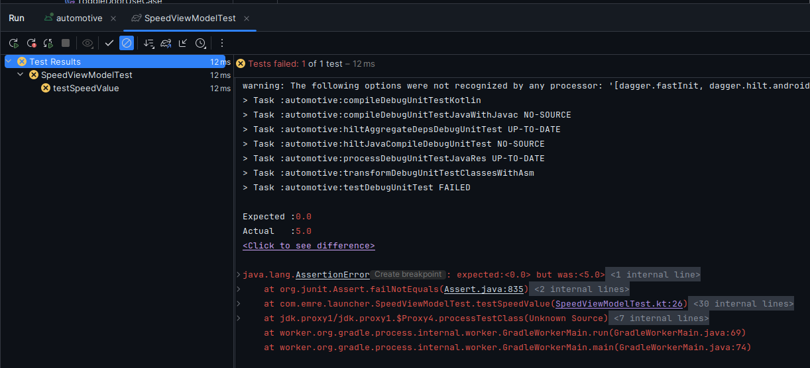
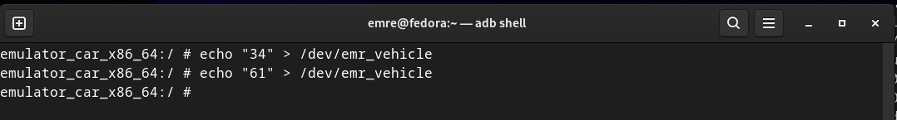
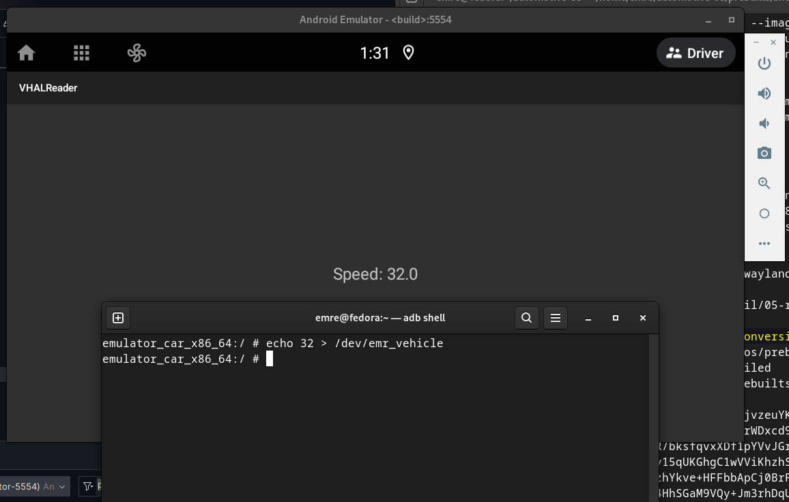
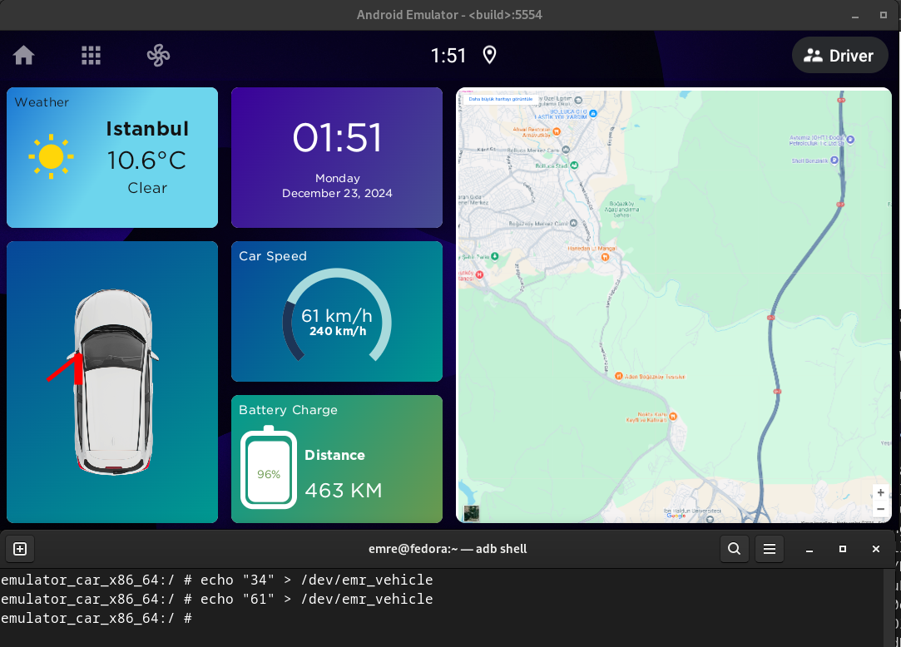

# TOGG Case Study

Before starting, the environment information is provided below, taken after the `lunch` command.

```bash
PLATFORM_VERSION_CODENAME=REL
PLATFORM_VERSION=13
TARGET_PRODUCT=sdk_car_x86_64
TARGET_BUILD_VARIANT=userdebug
TARGET_BUILD_TYPE=release
TARGET_ARCH=x86_64
TARGET_ARCH_VARIANT=x86_64
TARGET_2ND_ARCH=x86
TARGET_2ND_ARCH_VARIANT=x86_64
HOST_ARCH=x86_64
HOST_2ND_ARCH=x86
HOST_OS=linux
HOST_OS_EXTRA=Linux-6.11.10-200.fc40.x86_64-x86_64-Fedora-Linux-40-(Workstation-Edition)
HOST_CROSS_OS=windows
HOST_CROSS_ARCH=x86
HOST_CROSS_2ND_ARCH=x86_64
HOST_BUILD_TYPE=release
BUILD_ID=TQ3A.230805.001.S1
OUT_DIR=out
PRODUCT_SOONG_NAMESPACES=device/generic/goldfish device/generic/goldfish-opengl hardware/g
oogle/camera hardware/google/camera/devices/EmulatedCamera device/generic/goldfish device/
generic/goldfish-opengl
```

## 1) Launcher and SystemUI customizations

### 1-a) EmrLauncher

EmrLauncher has been created to make a car infotainment system demo.

**Default Android Automotive OS Launcher (CarLauncher package):**


**EmrLauncher:**


**Info:** EmrLauncher has a few custom views. For e.g. door open or closed state was rendered using `Canvas`.

**NOTE:** WeatherCard was implemented to fetch weather state from OpenWeatherMap API but commented out that lines to hide API key. Because this repo is public. Currently weather information is hardcoded on screen.

#### Source Code Structure & Soong Package Of EmrLauncher

Third-party libraries like Retrofit and Hilt were used to make codebase more readable and maintainable with clean architecture. But unfortunately this situation caused a problem. Those libraries are not available in AOSP codebase. So Soong build system can't detect them while building. Then the prebuilt launcher APK has been added as a prebuilt app package and overrided the default AAOS launcher.

**NOTE:** This problem was realized later and since there was no time to add third-party libraries to the AOSP or rewriting launcher app codebase, so it was decided to add a prebuilt apk of the launcher.

**Android.bp of EmrLauncher**

```bash
android_app_import {
    name: "EmrLauncher",
    apk: "EmrLauncher.apk",
    certificate: "platform",
    privileged: true,
    dex_preopt: {
        enabled: false,
    },
    overrides: [
        "Launcher2",
        "Launcher3",
        "Launcher3QuickStep",
        "CarLauncher",
    ],
}
```

As can be seen, it has been developed with an effort to adhere clean architecture as much as possible using view models and file hierarchy. Used Kotlin and Jetpack Compose to build UI.

Codebase:
```bash
src/main/java/com/emre/launcher/
├── AppDrawerActivity.kt
├── data
│   ├── api
│   │   └── WeatherAPI.kt
│   ├── models
│   │   ├── AppInfo.kt
│   │   ├── Car.kt
│   │   ├── Weather.kt
│   │   └── WeatherResponse.kt
│   └── repository
│       ├── AppRepositoryImpl.kt
│       ├── AppRepository.kt
│       ├── WeatherRepositoryImpl.kt
│       └── WeatherRepository.kt
├── di
│   ├── CarModule.kt
│   └── WeatherModule.kt
├── domain
│   └── usecases
│       ├── GetLaunchableAppsUseCase.kt
│       ├── GetWeatherUseCase.kt
│       └── ToggleDoorUseCase.kt
├── EmrLauncherApplication.kt
├── MainActivity.kt
└── ui
    ├── cards
    │   ├── CarCard.kt
    │   ├── EnergyCard.kt
    │   ├── GradientCard.kt
    │   ├── MapsCard.kt
    │   ├── SpeedCard.kt
    │   ├── TimeCard.kt
    │   └── WeatherCard.kt
    ├── theme
    │   ├── Color.kt
    │   ├── Theme.kt
    │   └── Type.kt
    ├── viewmodels
    │   ├── AppDrawerViewModel.kt
    │   ├── CarViewModel.kt
    │   └── WeatherViewModel.kt
    └── views
        ├── BatteryChargeView.kt
        ├── CarView.kt
        ├── GothamText.kt
        └── Speedometer.kt
```

Also it has some unit tests:
```bash
└── test
    └── java
        └── com
            └── emre
                └── launcher
                    ├── CarViewModelTest.kt
                    └── SpeedViewModelTest.kt
```

SpeedViewModelTest caught a small bug.

The _speedState initial value was 5f in `SpeedViewModelTest.kt`. That was a mistake while happened in development stage.

```kotlin
private val _speedState = mutableFloatStateOf(5f)
```

So `assertEquals(0f, speedViewModel.speedState.value)` caught it and test failed. Then it was changed to 0f.




#### Fetching Vehicle Data From System

Normally there is no internal Android car library (`android.car`) in Android app projects. Car library can be added by Soong with:
```bash
static_libs: [
    "androidx.appcompat_appcompat",
    "android.car",
],   
```

Or it can be added by copying `android.car.jar` from AOSP build outputs.
Path:
```bash
out/target/product/emulator_car_x86_64/system/framework
```

Also these permissions must be added in AndroidManifest.xml to get vehicle data:
```xml
<uses-permission android:name="android.car.permission.CAR_INFO" />
<uses-permission android:name="android.car.permission.CAR_POWERTRAIN" />
<uses-permission android:name="android.car.permission.CAR_ENERGY_PORTS" />
<uses-permission android:name="android.car.permission.CAR_SPEED" />
<uses-permission android:name="android.car.permission.CAR_ENERGY" />
<uses-permission android:name="android.car.permission.CONTROL_CAR_ENERGY_PORTS" />
<uses-permission android:name="android.car.permission.CAR_VENDOR_EXTENSION" />
```

Normally app must request these permissions at runtime to get vehicle information but our launcher app is a priviliged system app.

`Android.bp` file line 7:
```bash
privileged: true
```

So not necessary to request runtime permission but the app permission priviliges should be declared in `frameworks/base/data/etc/privapp-permissions-platform.xml` like this:

```xml
<privapp-permissions package="com.emre.launcher">
    <permission name="android.permission.BIND_NOTIFICATION_LISTENER_SERVICE" />
    <permission name="android.permission.ACCESS_NOTIFICATION_POLICY" />
    <permission name="android.permission.RECEIVE_BOOT_COMPLETED" />
    <permission name="android.permission.MEDIA_CONTENT_CONTROL" />
    <permission name="android.permission.QUERY_ALL_PACKAGES" />
    <permission name="android.permission.INTERNET" />
    <permission name="android.permission.BIND_VEHICLE_SERVICE" />
    <permission name="android.car.permission.CAR_INFO" />
    <permission name="android.car.permission.CAR_POWERTRAIN" />
    <permission name="android.car.permission.CAR_ENERGY_PORTS" />
    <permission name="android.car.permission.CAR_SPEED" />
    <permission name="android.car.permission.CAR_ENERGY" />
    <permission name="android.car.permission.CONTROL_CAR_ENERGY_PORTS" />
    <permission name="android.car.permission.CAR_VENDOR_EXTENSION" />
</privapp-permissions>
```

Otherwise the Android OS will get into bootloop if you don't. (Happened before)

**Optional part:**
The VHAL that written in this case study, has generated a java library to get `VehicleProperties`. This class has vehicle property enums to get data from system. Actually it is not necessary but if you added a custom vendor property, it should be added.
You can also get custom property value via using property integer value without this class.

**Fetching Live Car Property Data**

The VHAL written in this case study, changes `PERF_VEHICLE_SPEED` value based on char device output. It is like reading a value from a driver. It will be explained later in this document.

Since we have `android.car` library in our project, we can register a callback to get car data:

```kotlin
mCarPropertyManager = Car.createCar(this).getCarManager(Car.PROPERTY_SERVICE) as CarPropertyManager
mCarPropertyManager.registerCallback(object : CarPropertyEventCallback {
    override fun onChangeEvent(carPropertyValue: CarPropertyValue<*>) {
        Log.d("vspeed","onChangeEvent(" + carPropertyValue.value + ")")
        speed.floatValue = carPropertyValue.value as Float
    }
    override fun onErrorEvent(propId: Int, zone: Int) {
        Log.d("vspeed", "error")
    }
}, VehiclePropertyIds.PERF_VEHICLE_SPEED, CarPropertyManager.SENSOR_RATE_NORMAL)
```
Then we can update our UI with it. This example was to get vehicle speed. Other properties can be fetched from system by this way.

### 1-b) SystemUI Modifications

**Default Android Automotive OS SystemUI interface:**


**New SystemUI with modifications:**


It can be seen that removed bottom navigation bar and removed Bluetooth, Wi-Fi and brightness quick action buttons. Also made status bar transparent and added home, all apps and HVAC button to the top left side.

SystemUI file changes can be discovered in this repo under `patches/SystemUI.patch`.

The all apps button at status bar was connected to the AllAppsActivity of EmrLauncher by this change:

```diff
-systemui:intent="intent:#Intent;action=com.android.car.carlauncher.ACTION_APP_GRID;package=com.android.car.carlauncher;launchFlags=0x24000000;end"
+systemui:intent="intent:#Intent;component=com.emre.launcher/.AppDrawerActivity;package=com.emre.launcher;launchFlags=0x24000000;end"
```

**Note:** SystemUI has overlay feature that UI can be changed with XML overlay files. But using overlay is not very effective because Java code can not be changed by this way. Google recommends not to use it if you want to make changes over XML. But if your changes are only related with XML, it is better to use overlay.

______________________________________

### 2-) CarUtility App

Another task in this case study was creating a system application that starts at boot time. That was done by registering a `BroadcastReceiver` and starting a foreground service. Also this app was added to the AOSP source code with Soong blueprint file and its source code. AOSP builds and installs it to the system.


**Android.bp:**

```bash
android_app {
    name: "CarUtility",
    platform_apis: true,
    srcs: ["automotive/src/main/**/*.java", "automotive/src/main/**/*.kt"],
    resource_dirs: ["automotive/src/main/res"],
    manifest: "automotive/src/main/AndroidManifest.xml",
    privileged: true,
    certificate: "platform",
    static_libs: [
        "androidx.appcompat_appcompat",
        "android.car",
    ],   
}
```

**DeviceBootReceiver.kt**

```kotlin
package com.emre.carutility

import android.content.BroadcastReceiver
import android.content.Context
import android.content.Intent
import java.util.Objects

class DeviceBootReceiver : BroadcastReceiver() {
    override fun onReceive(context: Context, intent: Intent) {
        if (Objects.requireNonNull<String?>(intent.action) == "android.intent.action.BOOT_COMPLETED") {
            val serviceIntent = Intent(context, UtilityService::class.java)
            context.startForegroundService(serviceIntent)
        }
    }
}
```

**AndroidManifest.xml**

```xml
<uses-permission android:name="android.permission.POST_NOTIFICATIONS" />
<uses-permission android:name="android.permission.RECEIVE_BOOT_COMPLETED"/>
<uses-permission android:name="android.permission.FOREGROUND_SERVICE" />
<uses-permission android:name="android.permission.FOREGROUND_SERVICE_DATA_SYNC" />
   <!-- This permissons was added to start a foreground service -->

   <!-- ...rest of it... -->

<receiver android:name=".DeviceBootReceiver"
        android:enabled="true"
        android:exported="true"
        android:permission="android.permission.RECEIVE_BOOT_COMPLETED">
    <intent-filter>
        <category android:name="android.intent.category.DEFAULT" />
        <action android:name="android.intent.action.BOOT_COMPLETED" />
        <action android:name="android.intent.action.ACTION_BOOT_COMPLETED" />
    </intent-filter>
</receiver>
```

______________________________________

### 3-) Creating a VHAL

Normally, this was not required within the case study, but a Linux character device driver was written to make it more realistic.
VHAL writes the data obtained from this driver to the speed data in the system.

#### 3-a) Creating A Char Device Driver & Building The Emulator Kernel

Building emulator kernel reference: https://source.android.com/docs/setup/build/building-kernels

**Fetching kernel source**

```bash
mkdir android-kernel && cd android-kernel
repo init -u https://android.googlesource.com/kernel/manifest -b common-android13-5.15 --depth=1
repo sync
```

Used common-android13-5.15 kernel since the AOSP/AAOS version is 13.

**Adding char device driver code to the kernel**

Kernel source code is located at `common` folder in this repo. So driver can be added in:
`drivers/misc`

Char device driver file:
[kernel/drivers/misc/emr_vehicle.c](kernel/drivers/misc/emr_vehicle.c)

Added driver option to the **drivers/misc/Kconfig**
```bash
config EMR_VEHICLE
    tristate "EMRVehicle Test Driver"
    default y
    help
      This is a simple driver to create /dev/emr_vehicle for testing purposes.

```

Added Makefile command to the **drivers/misc/Makefile**
```makefile
obj-$(CONFIG_EMR_VEHICLE)   += emr_vehicle.o
```
Or it can be just added for not dealing with defconfig files:
```makefile
obj-y += emr_vehicle.o
```
**Building The Kernel**

Built it with:
```bash
BUILD_CONFIG=common-modules/virtual-device/build.config.virtual_device.x86_64 build/build.sh
```

After compilation, kernel image is located at:
`out/android13-5.15/dist/bzImage`

Emulator can boot with new kernel using this command:

```bash
emulator -kernel <bzImage-path> -no-snapshot-load
```

**NOTE:** `-no-snapshot-load` argument is important because emulator may not boot with new images.



As you can see, we have /dev/emr_vehicle.

#### 3-b) Creating VHAL

The VHAL in this case study has some parts from a third party repo which is based on Google's VHAL in AOSP source code. The third party part is about adding a "simulator" to change vehicle properties (`Simulator.cpp`) and thread utility (`Runnable.h`) code to run it in a endless loop.

AOSP VHAL: `hardware/interfaces/automotive/vehicle/2.0/default/impl/vhal_v2_0`

Reference Third Party VHAL: https://github.com/nkh-lab/aosp-ncar-vehicle-hal

Final VHAL, takes speed value from `/dev/emr_vehicle` instead of taking/generating property values from somewhere. So added a sepolicy rule to access to `/dev/emr_vehicle`.

**VHAL File Structure**
```bash
├── 1.0
│   ├── Android.bp
│   └── types.hal
├── Android.bp
├── sepolicy
│   ├── file_contexts
│   └── hal_togg_emre_vehicle.te
├── src
│   ├── DefaultConfig.h
│   ├── Runnable.h
│   ├── Simulator.cpp
│   ├── Simulator.h
│   ├── VehicleHalClient.cpp
│   ├── VehicleHalClient.h
│   ├── VehicleHalImpl.cpp
│   ├── VehicleHalImpl.h
│   └── VehicleService.cpp
├── togg.emre.vehicle@1.0-service.rc
└── togg.emre.vehicle@1.0-service.xml
```

**1.0 directory**:

It has Android.bp to make a HAL package. It generates shared object and Java code to include things in `types.hal`.

`types.hal`: Has `VehicleProperty` definitions that inherited from AOSP. Also has a custom vendor property that not used in this case study. For e.g. `Simulator.cpp` can access device properties by this file via including 
```c
#include "togg/emre/vehicle/1.0/types.h"
```

**Android.bp**:

This one has Soong instructions to build complete custom VHAL. Includes shared libraries from AOSP and HAL package that mentioned above. The important part is it has "overrides" declaration which overrides AOSP default VHAL service and emulator VHAL service.

**SELinux Policy**

As it can be seen that `hal_togg_emre` domain is a VHAL domain. It has unique permissions for a VHAL. For e.g. it can't be registered by any other service manager. SELinux will deny it.

Also it has rw, open, ioctl permissions to access `/dev/emr_vehicle`.

```bash
type hal_togg_emre, domain;
type hal_togg_emre_exec, exec_type, vendor_file_type, file_type;

init_daemon_domain(hal_togg_emre);

hal_server_domain(hal_togg_emre, hal_vehicle)

type emr_vehicle_device, dev_type;
allow hal_togg_emre emr_vehicle_device:chr_file { read write open ioctl };
```
It can be seen that sepolicy has a char device rule to access it.

`file_contexts` to define files that will be used by this VHAL:

```bash
/dev/emr_vehicle  u:object_r:emr_vehicle_device:s0
/vendor/bin/hw/togg.emre.vehicle@1.0-service u:object_r:hal_togg_emre_exec:s0
```

**DefaultConfig.h**

Based on `hardware/interfaces/automotive/vehicle/2.0/default/impl/vhal_v2_0/DefaultConfig.h`.
Because the new VHAL overrides other internal VHALs. So it has to contain all properties in itself.

**Runnable.h**

Just a C++ thread utility to make code more clean & modular.

**Simulator.cpp**

Extends `VehicleHalClient` and `Runnable` classes. Because it is a VehicleHalClient and sets/gets vehicle property values. In this case study, it reads speed value from `/dev/emr_vehicle` and sets `VehicleProperty::PERF_VEHICLE_SPEED`.

**VehicleService.cpp**

It has main code. Registers as a service via `VehicleHalManager` with `VehicleHalImpl` which contains a `VehicleHalClient` as `Simulator`.

Other C++ files are from AOSP VHAL implementation. They override AOSP VHAL functions.

**togg.emre.vehicle@1.0-service.rc**

It has service initialization definitons like service class, user, group. It has to be compatible with SELinux policy. Otherwise SELinux deny the service registration.

**togg.emre.vehicle@1.0-service.xml**

It has HAL definitions.

______________________________________

### 4-) VHALReader

This is a very simple app that reads speed value from the VHAL that created. EmrLauncher also does it but this was an another task in case study. So this app was created and named it "VHALReader".
It has `android.car` library with jar file that taken from AOSP build like explained before.



**EmrLauncher:**

Reading speed from `/dev/emr_vehicle` via VHAL that created before. (`togg.emre.vehicle@1.0-service`)



It has also a Soong file (Android.bp) and AOSP can build and install it to the system.

**NOTE:** This app is not a priviliged app. So it has to request runtime permission to get vehicle speed.

```kotlin
val permissions: MutableList<String> = ArrayList()
permissions.add(Car.PERMISSION_SPEED)

if (checkSelfPermission(Car.PERMISSION_SPEED) != PackageManager.PERMISSION_GRANTED) {
    requestPermissions(permissions.toTypedArray(), REQUEST_CODE_ASK_PERMISSIONS)
} else {
    setSpeedToView()
}
```

Source code is located in `packages/apps/Car/VHALReader` in this repository.
______________________________________

### 5-) Device Repo Changes For Emulator Build

Those changes are added to emulator build. This part explains how.

#### 5-a) SELinux Policy

The VHAL service (`togg.emre.vehicle@1.0-service`) has a SELinux policy which file is `hal_togg_emre_vehicle.te`. It was located in `device/generic/car/common/sepolicy` and added `file_contexts` definitions there.

#### 5-b) Packages

All of the packages that explained before are added in the Makefile which located in `device/generic/car/common/car.mk`

```bash
PRODUCT_PACKAGES += togg.emre.vehicle@1.0-service
PRODUCT_PACKAGES += EmrLauncher
PRODUCT_PACKAGES += CarUtility
PRODUCT_PACKAGES += VHALReader
```